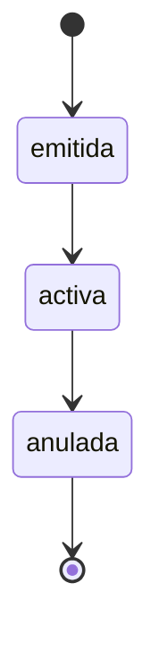

# 🏥 Sistema de Gestión de Pólizas de Salud

Un sistema robusto para la gestión de pólizas de salud desarrollado con **NestJS** y **TypeScript**.

## 📋 Tabla de Contenidos

- [Características](#-características)
- [Tecnologías](#-tecnologías)
- [Instalación](#-instalación)
- [Configuración](#-configuración)
- [Uso](#-uso)
- [API Endpoints](#-api-endpoints)
- [Validaciones](#-validaciones)
- [Testing](#-testing)
- [Estructura del Proyecto](#-estructura-del-proyecto)
- [Contribución](#-contribución)
- [Licencia](#-licencia)

## ✨ Características

- 🏗️ **Arquitectura Modular**: Diseño escalable con NestJS
- 🔒 **Validación Robusta**: Validaciones de entrada con class-validator
- 📊 **Estados de Póliza**: Gestión de estados (emitida → activa → anulada)
- 🔍 **Filtros Avanzados**: Búsqueda por estado y fecha de emisión
- 🧪 **Testing Completo**: Tests unitarios con Jest
- 🏥 **Health Check**: Monitoreo del estado de la aplicación
- 📝 **Logging Detallado**: Trazabilidad completa de operaciones
- 🎯 **TypeScript**: Tipado estático para mayor seguridad

## 🛠️ Tecnologías

- **Framework**: NestJS
- **Lenguaje**: TypeScript
- **Validación**: class-validator, class-transformer
- **Testing**: Jest
- **Gestión de Paquetes**: Yarn
- **Linting**: ESLint
- **Formateo**: Prettier

## 🚀 Instalación

### Prerrequisitos

- Node.js (v18 o superior)
- Yarn

### Pasos de Instalación

1. **Clonar el repositorio**
   ```bash
   git clone <repository-url>
   cd gestion-polizas
   ```

2. **Instalar dependencias**
   ```bash
   yarn install
   ```

3. **Compilar el proyecto**
   ```bash
   yarn build
   ```

## ⚙️ Configuración

### Variables de Entorno

Crea un archivo `.env` en la raíz del proyecto:

```env
NODE_ENV=development
PORT=3000
```

### Configuración de Desarrollo

```bash
# Modo desarrollo con hot-reload
yarn start:dev

# Modo producción
yarn start:prod
```

## 🎯 Uso

### Iniciar la Aplicación

```bash
# Desarrollo
yarn start:dev

# Producción
yarn start:prod
```

La aplicación estará disponible en `http://localhost:3000`

### Health Check

```bash
curl http://localhost:3000/health
```

## 📡 API Endpoints

### 🏥 Health Check

| Método | Endpoint | Descripción |
|--------|----------|-------------|
| GET | `/health` | Estado de la aplicación |

**Respuesta:**
```json
{
  "status": "ok",
  "timestamp": "2024-01-15T10:30:00.000Z",
  "uptime": 3600,
  "environment": "development",
  "version": "1.0.0"
}
```

### 📋 Pólizas

| Método | Endpoint | Descripción |
|--------|----------|-------------|
| POST | `/policies` | Crear nueva póliza |
| GET | `/policies` | Listar pólizas (con filtros) |
| GET | `/policies/:id` | Obtener póliza por ID |
| PATCH | `/policies/:id` | Actualizar póliza |
| PUT | `/policies/:id/status` | Actualizar estado de póliza |
| DELETE | `/policies/:id` | Eliminar póliza |

#### Crear Póliza

```bash
POST /policies
Content-Type: application/json

{
  "rutTitular": "12345678-9",
  "planSalud": "Plan Premium",
  "prima": 50000
}
```

**Respuesta:**
```json
{
  "id": "uuid-generated",
  "rutTitular": "12345678-9",
  "fechaEmision": "2024-01-15T10:30:00.000Z",
  "planSalud": "Plan Premium",
  "prima": 50000,
  "estado": "emitida"
}
```

#### Listar Pólizas

```bash
# Sin filtros
GET /policies

# Con filtros
GET /policies?estado=emitida&fechaEmision=2024-01-15
```

#### Actualizar Estado

```bash
PUT /policies/:id/status
```

**Transiciones de Estado:**
- `emitida` → `activa`
- `activa` → `anulada`
- `anulada` → ❌ (No permitido)

## 🔍 Validaciones

### RUT (RUT Chileno)
- Formato: `12345678-9`
- Longitud: 8-12 caracteres
- Dígito verificador válido

### Plan de Salud
- Longitud: 2-50 caracteres
- Campo obligatorio

### Prima
- Rango: $1,000 - $1,000,000
- Tipo: número
- Campo obligatorio

### Ejemplo de Error de Validación

```json
{
  "statusCode": 400,
  "message": [
    "El RUT debe tener el formato válido (ej: 12345678-9)",
    "La prima mínima es $1,000"
  ],
  "error": "Bad Request"
}
```

## 🧪 Testing

### Ejecutar Tests

```bash
# Todos los tests
yarn test

# Tests unitarios
yarn test --testPathPattern="spec.ts"

# Tests con cobertura
yarn test:cov

# Tests e2e
yarn test:e2e
```

### Cobertura de Tests

- ✅ **PoliciesController**: 19 tests
- ✅ **PoliciesService**: 29 tests
- ✅ **AppController**: 1 test
- 📊 **Total**: 49 tests pasando

## 📁 Estructura del Proyecto

```
src/
├── app.controller.ts          # Controlador principal
├── app.module.ts              # Módulo principal
├── app.service.ts             # Servicio principal
├── main.ts                    # Punto de entrada
├── common/
│   └── interfaces/
│       └── api.interfaces.ts  # Interfaces de API
├── health/
│   ├── health.controller.ts   # Controlador de health check
│   ├── health.service.ts      # Servicio de health check
│   └── health.module.ts       # Módulo de health check
└── policies/
    ├── dto/
    │   ├── create-poliza.dto.ts    # DTO para crear pólizas
    │   └── update-poliza.dto.ts    # DTO para actualizar pólizas
    ├── entities/
    │   └── policy.entity.ts        # Entidad de póliza
    ├── interfaces/
    │   └── policy.interfaces.ts    # Interfaces de políticas
    ├── types/
    │   └── policy.types.ts         # Tipos de políticas
    ├── policies.controller.ts      # Controlador de políticas
    ├── policies.service.ts         # Servicio de políticas
    ├── policies.module.ts          # Módulo de políticas
    ├── policies.controller.spec.ts # Tests del controlador
    └── policies.service.spec.ts    # Tests del servicio
```

## 🔧 Scripts Disponibles

```bash
# Desarrollo
yarn start:dev          # Iniciar en modo desarrollo
yarn start:debug        # Iniciar en modo debug

# Producción
yarn build              # Compilar proyecto
yarn start:prod         # Iniciar en modo producción

# Testing
yarn test               # Ejecutar tests
yarn test:watch         # Tests en modo watch
yarn test:cov           # Tests con cobertura
yarn test:e2e           # Tests end-to-end

# Calidad de Código
yarn lint               # Ejecutar linter
yarn format             # Formatear código
```

## 📊 Estados de Póliza



## 🚀 Despliegue

### Docker (Recomendado)

```dockerfile
FROM node:18-alpine
WORKDIR /app
COPY package*.json ./
RUN yarn install --production
COPY dist ./dist
EXPOSE 3000
CMD ["node", "dist/main"]
```

### Variables de Entorno para Producción

```env
NODE_ENV=production
PORT=3000
```

## 🤝 Contribución

1. Fork el proyecto
2. Crea una rama para tu feature (`git checkout -b feature/AmazingFeature`)
3. Commit tus cambios (`git commit -m 'Add some AmazingFeature'`)
4. Push a la rama (`git push origin feature/AmazingFeature`)
5. Abre un Pull Request

### Estándares de Código

- Usar TypeScript estricto
- Seguir las convenciones de NestJS
- Escribir tests para nuevas funcionalidades
- Usar conventional commits

## 📝 Changelog

### v1.0.0
- ✅ Sistema básico de gestión de pólizas
- ✅ Validaciones robustas con class-validator
- ✅ Health check endpoint
- ✅ Tests unitarios completos
- ✅ Logging detallado
- ✅ Gestión de estados de póliza

## 📞 Soporte

Si tienes preguntas o necesitas ayuda:

- 📧 Email: [tu-email@ejemplo.com]
- 🐛 Issues: [GitHub Issues](https://github.com/tu-usuario/gestion-polizas/issues)
- 📖 Documentación: [NestJS Docs](https://docs.nestjs.com/)

## 📄 Licencia

Este proyecto está bajo la Licencia MIT. Ver el archivo [LICENSE](LICENSE) para más detalles.

---

<p align="center">
  Desarrollado con ❤️ usando <a href="https://nestjs.com">NestJS</a>
</p>